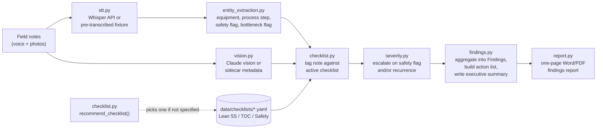

# On-Site Operational Audit Copilot

An agent that turns unstructured field notes from a facility walk — dictated voice observations plus photos — into a standardized, checklist-driven findings report. The checklist itself is swappable: point the same pipeline at a Lean 5S audit, a Theory of Constraints "find the constraint" walk, or a safety & compliance walk, and it tags, scores, and writes up the visit through that specific lens, recommending the right one from a one-line description of the engagement if you don't pick one yourself.

Three synthetic site visits are included at one fictional facility, one per checklist, so you can see the range: a routine organization check that comes back mild, a throughput walk that finds a real bottleneck, and a safety walk after a near-miss that comes back critical. The agent scores them Mild, Significant, and Critical — for reasons you can check note by note in each report.

**No real facility's data is used anywhere in this repository.** Every field note, photo, and piece of metadata is synthetic, generated by `scripts/generate_synthetic_data.py`, and every photo is a plain programmatically-drawn placeholder, not a stock image or a real jobsite photo. See the note at the top of each generated report.

---

## Problem

An operational site visit produces a pile of loose observations — dictated notes, photos, a mental checklist — that someone then has to turn into a findings report by hand: transcribe, sort, decide what's a real finding versus a passing comment, decide how bad each one is, write it up. That translation step is where a good walk turns into a useful report or doesn't. It's also where the lens matters: the same floor walked with a 5S mindset, a bottleneck-finding mindset, or a safety mindset produces three different reports from three different sets of observations, and a tool that only knows how to do one of those isn't actually reusable across the kinds of visits an operator or a consultant actually runs.

## Why I built it

This one is built on the floor, not from a dashboard. At Siemens I ran a 39-person team responsible for shop-floor material movement — walking the line, seeing what was actually happening at each station versus what the standard said should be happening, and knowing the difference between a one-off mess and a systemic pattern. At Amazon, peak-season floor work meant watching a line in real time and knowing within a walk-through where product was backing up and why, before a report could tell you.

That's the judgment this agent tries to encode: not just "did this note mention a problem," but which lens the observation should be read through, whether it's a one-off or a pattern worth escalating, and when photo evidence and dictated evidence are actually describing the same underlying issue versus two different ones. The checklist being swappable via a YAML config isn't a configuration nicety — it's the direct expression of the fact that a 5S walk, a constraint walk, and a safety walk are three different jobs that happen to use the same inputs (notes, photos, a floor) and the same output shape (a prioritized, evidence-backed report).

## Architecture



| Module | Responsibility |
|---|---|
| `stt.py` | Transcribes voice field notes. Live mode calls OpenAI's Whisper API; the demo instead ships pre-transcribed dictation text, since faking realistic speech audio would test nothing real (see the module docstring for the full reasoning). |
| `vision.py` | Captions and matches photos. Live mode calls Claude's multimodal input directly on the image; without a key, falls back to a sidecar metadata file shipped next to each synthetic photo. |
| `entity_extraction.py` | Pulls equipment, process step, safety flag, and bottleneck flag out of a transcribed note. LLM-assisted with a keyword-rules fallback. |
| `checklist.py` | Loads the swappable YAML checklist configs, recommends one from a one-line engagement description, and tags each note against whichever checklist is active. |
| `keyword_match.py` | Shared negation-aware keyword matcher used by both `entity_extraction.py` and `checklist.py`'s rules fallback — see "A bug worth naming" below. |
| `severity.py` | Turns a checklist item's default severity into the finding's actual severity, escalating on a safety flag and/or on recurrence across 3+ notes. The two can stack. |
| `findings.py` | Aggregates tagged notes and photo matches into `Finding` objects, builds the prioritized action list, and writes the executive summary (LLM-assisted, template fallback). |
| `report.py` | Renders the one-page `.docx`: executive summary, findings by severity, a prioritized action list, a methodology/scope disclosure, and a full note-to-finding traceability appendix. |
| `llm.py` | The only place `ANTHROPIC_API_KEY` is read for text and vision. Every call has a rules-based fallback. |

**A bug worth naming, because it's instructive:** the first version of the rules-based tagger matched keywords with plain substring checks, which meant a note saying "**no** backlog there, running fine" still matched the keyword "backlog" and got tagged as a live bottleneck finding — a false positive from pure negation-blindness. The same version also broke ties by whichever checklist item happened to be listed first in the YAML, so a note that matched both "waiting on" (identify-the-constraint) and the more specific "waiting on a part" (exploit-the-constraint) at one hit each was silently misfiled under the wrong category. Both are fixed in `keyword_match.py`: matches within a short window of a negation cue ("no ", "wasn't ", "haven't ", etc.) are dropped, and ties are broken by the length of the matched phrase, not list order. `tests/test_pipeline.py` has a regression test for each so they can't come back quietly.

## How to run it

```bash
git clone https://github.com/kareembrantley-lab/onsite-audit-copilot.git
cd onsite-audit-copilot
python3 -m venv .venv && source .venv/bin/activate
pip install -r requirements.txt

# Regenerate the synthetic field notes/photos and run all three demo visits:
python scripts/generate_synthetic_data.py
python scripts/run_audit.py --demo

# Run the test suite:
pytest tests/ -v

# Run against a real site visit (checklist is auto-recommended from the
# engagement description unless you pass --checklist explicitly):
export ANTHROPIC_API_KEY=...   # entity extraction, tagging, vision captioning, synthesis
export OPENAI_API_KEY=...      # Whisper transcription -- https://platform.openai.com/docs/guides/speech-to-text
python scripts/run_audit.py --visit-dir path/to/your_visit --out-dir output/your_visit
```

A visit directory needs a `visit_config.json` (facility name, area, date, engagement description) and a `notes.json` listing each voice note (`audio_path` in live mode) and photo (`image_path`) — see `data/synthetic/*/` for the exact shape.

PDF rendering uses headless LibreOffice if it's installed; otherwise the pipeline still produces the `.docx` and skips the PDF conversion.

Without `ANTHROPIC_API_KEY`/`OPENAI_API_KEY` set, the pipeline runs the same steps end-to-end on keyword rules, sidecar photo metadata, and templated language — every score and every report still gets produced, just with rules-based rationale text instead of an LLM-generated one.

## Sample output

Running `--demo` regenerates the three synthetic site visits and produces:

| Visit | Checklist (auto-recommended) | Read | What it catches |
|---|---|---|---|
| Final Assembly Line | Lean 5S Audit | 🟡 Mild — 2 high, 2 medium, 4 low findings | Recurring clutter at two workstations (escalates to high on the 3rd+ instance), a missing shadow board, an outdated posted standard, and a 5S checklist that's only really filled out right before an audit. |
| Packaging & Ship Line | TOC — Find the Constraint | 🟠 Significant — 1 critical, 1 high, 3 medium | A clear, recurring queue in front of the shrink-wrap station (escalates to critical), staged-changeover losses at the constraint itself, and upstream stations overproducing ahead of it — the full shape of a real bottleneck, not just one symptom. |
| Receiving Dock | Safety & Compliance Walk | 🔴 Critical — 4 critical, 1 medium, 1 low | An unguarded conveyor pinch point, a blocked emergency exit and an expired fire extinguisher, three separate PPE gaps, and a recurring trip/electrical hazard on the main walkway — the last one a direct example of the two escalation rules stacking (safety-flagged *and* recurring), taking a "medium" housekeeping issue to "critical." |

Full generated reports (`.docx` and `.pdf`) for all three visits are in [`sample_output/`](sample_output/).

## What I'd do with more time

- **A real mobile capture front end.** This repo is deliberately a backend-agent showcase (per the build spec) — a real deployment needs the actual walk-and-dictate mobile interface, not a JSON fixture file.
- **Photo-to-note linking.** Right now a photo and a voice note about the same physical thing are two separate pieces of evidence under the same checklist item; recognizing "these two are the same observation" (by timestamp proximity and location) would tighten occurrence counts.
- **A richer negation/qualifier model.** The negation guard in `keyword_match.py` handles the common, cleanly worded case ("no backlog") but not everything ("not unlike a bottleneck" would still slip through) — the LLM-assisted path doesn't have this gap at all, since it reads the whole sentence.
- **Cross-visit trend tracking**, the same way the sibling `smb-public-signal-audit-agent` project tracks cross-run trends — the same location audited quarterly should show whether a recurring finding actually got fixed.
- **A confidence-weighted overall score** per visit (mirroring `smb-public-signal-audit-agent`'s scoring engine) instead of reading the severity mix by eye.

## Repository layout

```
onsite-audit-copilot/
├── src/onsite_audit_copilot/   # the agent: stt, vision, entity extraction, checklist, severity, findings, report
├── scripts/                    # generate_synthetic_data.py, run_audit.py (CLI)
├── data/
│   ├── checklists/             # the 3 swappable YAML checklist configs
│   └── synthetic/              # the 3 demo site visits (notes + photos)
├── sample_output/               # generated reports from --demo
├── tests/                      # pytest coverage, including 2 real bugs caught while building this
└── docs/architecture.md        # module-by-module data contracts
```

CI (`.github/workflows/tests.yml`) runs the test suite and the full `--demo` pipeline as a smoke test on every push.

## License

MIT — see [LICENSE](LICENSE).
